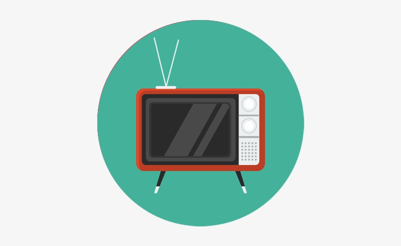

# Televisão Ultilizando POO

 

----------------- OBJETIVO --------------------  
-> esse foi um codigo criado com o objetivo de praticar POO(programação orientada a Objetos) nesta atividade foi uma tentativa de simular uma televisão e algumas de suas funcionalidades.  
----------------- Comandos --------------------- 
--> ligar(), passado para ligar a televisão. 
--> desligar(), passado para desligar a televisão. 
--> botãovolume(), pode ser passado "+" ou "-" e a quantidades de vezes padrão = 1  
exemplo: ao chamar  t1.botãovolume("+",5) , o botão sera presionado 5 vezes.  
--> botãoCanal(), pode ser passado "+" ou "-" e a quantidades de vezes padrão = 1  
exemplo: ao chamar  t1.botãoCanal("+",3) , o botão sera presionado 3 vezes. caso detectado uma frequencia ele ia avisar.  
--> quebrar(), para quebrar para deixar a televisão inutilisavel.  
--> consertar(), conserta a televisão caso esteja quebrada.  

------------- Resultados --------------- 
-> este codigo foi pensando para gerar saidas, caso seja iniciado a ligação da televisão 2 vezes seguidas, ou tentar desligar a televisão ja no estado desligado, ou tentando ligar uma televisão quebrada ou tentando aumentar volume com ela quebrada ou desligada, possiveis tentativa ilogicas que geram saidas dependendo da atividade tomada pelo usuario.  
-> Divirta-se e sinta-se livre para alterar ou melhorar o codigo.

